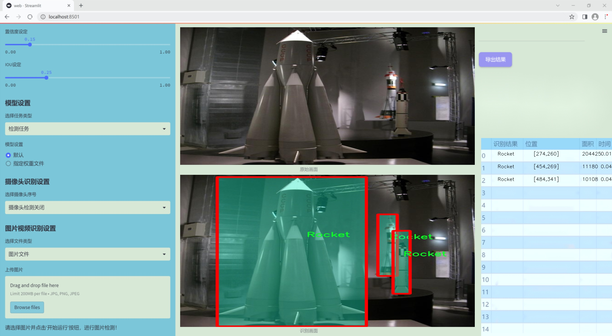
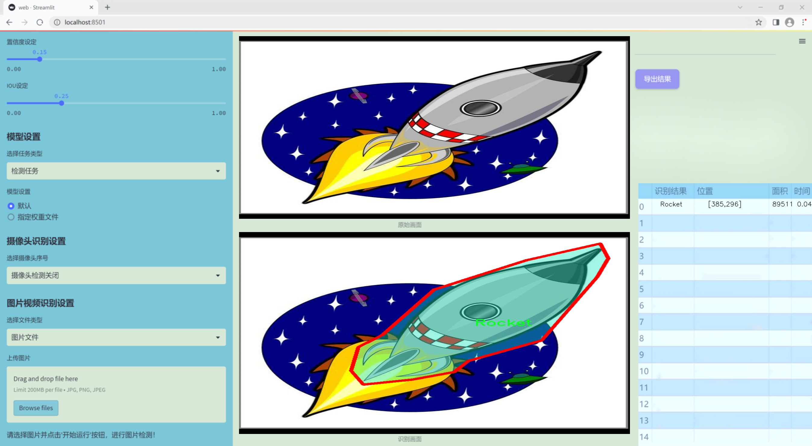
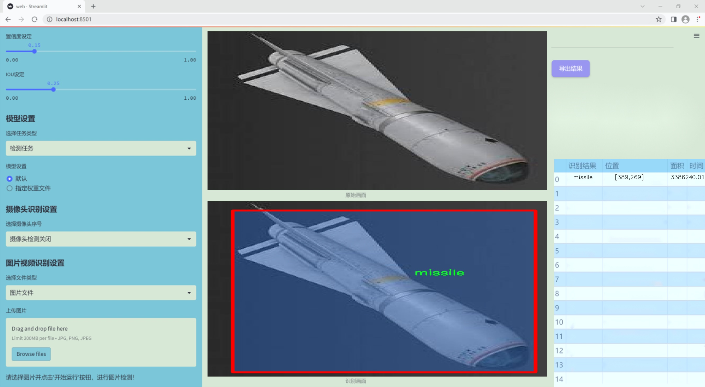
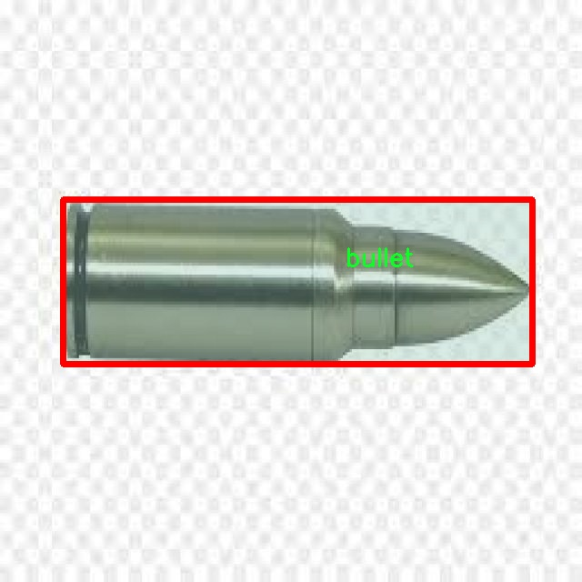
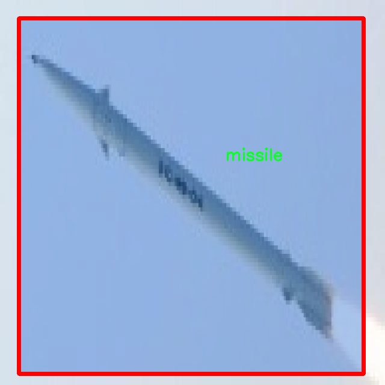
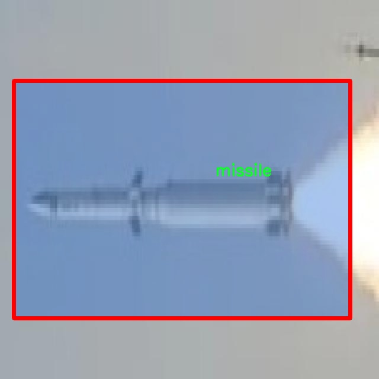
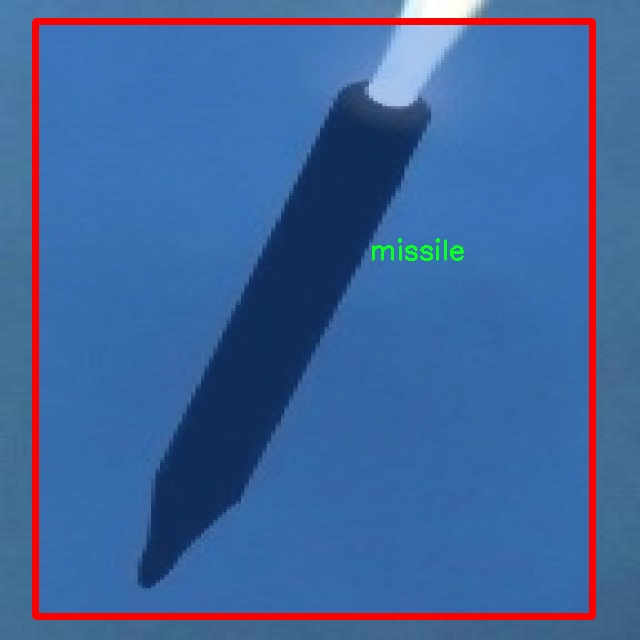
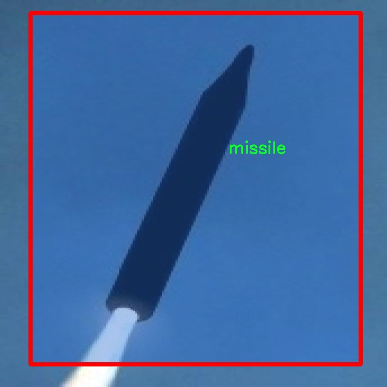

### 1.背景意义

研究背景与意义

随着科技的迅猛发展，武器系统的检测与识别在军事和安全领域中变得愈发重要。传统的武器目标检测方法往往依赖于人工识别和经验判断，效率低下且容易受到人为因素的影响。因此，基于深度学习的自动化检测系统应运而生，成为提升武器目标识别精度和效率的关键技术之一。YOLO（You Only Look Once）系列模型以其快速和高效的特性，成为目标检测领域的热门选择。特别是YOLOv11的改进版本，凭借其在实时检测中的卓越表现，展现出在复杂环境中识别武器目标的潜力。

本研究旨在基于改进的YOLOv11模型，构建一个高效的武器目标检测系统。所使用的数据集“MISSILEBULLETROCKET 2”包含1200幅图像，涵盖火箭、子弹和导弹三类目标，具有良好的代表性和多样性。通过对这些图像的深度学习训练，期望能够显著提高模型在武器目标检测中的准确性和鲁棒性。此外，数据集的标注采用YOLOv8格式，确保了与YOLO系列模型的兼容性，为后续的模型训练和优化提供了便利。

本研究的意义不仅在于提升武器目标检测的技术水平，更在于为军事安全、反恐和公共安全等领域提供一种高效、可靠的解决方案。通过实现自动化的武器目标检测系统，可以大幅度降低人工干预的需求，提高反应速度，进而增强整体安全防护能力。同时，随着数据集的不断丰富和模型的持续优化，未来的武器目标检测系统将能够适应更加复杂和多变的环境，为相关领域的应用提供强有力的支持。

### 2.视频效果

[2.1 视频效果](https://www.bilibili.com/video/BV1a9roYtEeB/)

### 3.图片效果







##### [项目涉及的源码数据来源链接](https://kdocs.cn/l/cszuIiCKVNis)**

注意：本项目提供训练的数据集和训练教程,由于版本持续更新,暂不提供权重文件（best.pt）,请按照6.训练教程进行训练后实现上图演示的效果。

### 4.数据集信息

##### 4.1 本项目数据集类别数＆类别名

nc: 3
names: ['Rocket', 'bullet', 'missile']


该项目为【图像分割】数据集，请在【训练教程和Web端加载模型教程（第三步）】这一步的时候按照【图像分割】部分的教程来训练

##### 4.2 本项目数据集信息介绍

本项目数据集信息介绍

本项目旨在通过改进YOLOv11算法，构建一个高效的武器目标检测系统。为实现这一目标，我们采用了主题为“MISSILEBULLETROCKET 2”的数据集，该数据集专注于三种特定类别的武器目标：火箭（Rocket）、子弹（Bullet）和导弹（Missile）。数据集包含三类目标，这些目标在军事和安全领域中具有重要的应用价值，尤其是在实时监控和威胁评估中。

数据集的构建经过精心设计，确保了样本的多样性和代表性。每一类目标均包含大量的图像样本，这些样本涵盖了不同的拍摄角度、光照条件和背景环境，旨在提高模型的泛化能力和鲁棒性。通过对这些目标的准确标注，数据集为模型训练提供了坚实的基础，使得YOLOv11能够有效地识别和分类不同类型的武器目标。

在数据集的准备过程中，我们特别关注了数据的质量和标注的准确性。每个类别的图像都经过严格筛选，确保其在特征上具有显著的区分度。这种精细化的处理不仅有助于提升模型的检测精度，也为后续的模型评估提供了可靠的依据。此外，数据集还考虑到了实际应用场景中的复杂性，涵盖了多种环境下的武器目标，以便模型能够在真实世界中表现出色。

综上所述，"MISSILEBULLETROCKET 2"数据集为本项目提供了丰富的训练素材，涵盖了火箭、子弹和导弹三大类目标，旨在通过改进YOLOv11算法，提升武器目标检测的准确性和效率，为相关领域的研究和应用提供有力支持。











### 5.全套项目环境部署视频教程（零基础手把手教学）

[5.1 所需软件PyCharm和Anaconda安装教程（第一步）](https://www.bilibili.com/video/BV1BoC1YCEKi/?spm_id_from=333.999.0.0&vd_source=bc9aec86d164b67a7004b996143742dc)


[5.2 安装Python虚拟环境创建和依赖库安装视频教程（第二步）](https://www.bilibili.com/video/BV1ZoC1YCEBw?spm_id_from=333.788.videopod.sections&vd_source=bc9aec86d164b67a7004b996143742dc)

### 6.改进YOLOv11训练教程和Web_UI前端加载模型教程（零基础手把手教学）

[6.1 改进YOLOv11训练教程和Web_UI前端加载模型教程（第三步）](https://www.bilibili.com/video/BV1BoC1YCEhR?spm_id_from=333.788.videopod.sections&vd_source=bc9aec86d164b67a7004b996143742dc)


按照上面的训练视频教程链接加载项目提供的数据集，运行train.py即可开始训练



     Epoch   gpu_mem       box       obj       cls    labels  img_size
     1/200     20.8G   0.01576   0.01955  0.007536        22      1280: 100%|██████████| 849/849 [14:42<00:00,  1.04s/it]
               Class     Images     Labels          P          R     mAP@.5 mAP@.5:.95: 100%|██████████| 213/213 [01:14<00:00,  2.87it/s]
                 all       3395      17314      0.994      0.957      0.0957      0.0843

     Epoch   gpu_mem       box       obj       cls    labels  img_size
     2/200     20.8G   0.01578   0.01923  0.007006        22      1280: 100%|██████████| 849/849 [14:44<00:00,  1.04s/it]
               Class     Images     Labels          P          R     mAP@.5 mAP@.5:.95: 100%|██████████| 213/213 [01:12<00:00,  2.95it/s]
                 all       3395      17314      0.996      0.956      0.0957      0.0845

     Epoch   gpu_mem       box       obj       cls    labels  img_size
     3/200     20.8G   0.01561    0.0191  0.006895        27      1280: 100%|██████████| 849/849 [10:56<00:00,  1.29it/s]
               Class     Images     Labels          P          R     mAP@.5 mAP@.5:.95: 100%|███████   | 187/213 [00:52<00:00,  4.04it/s]
                 all       3395      17314      0.996      0.957      0.0957      0.0845


###### [项目数据集下载链接](https://kdocs.cn/l/cszuIiCKVNis)

### 7.原始YOLOv11算法讲解

YOLO11采用改进的骨干和颈部架构，增强了特征提取能力，提高了物体检测的精确度和复杂任务的表现。YOLO11引入精炼的架构设计和优化的训练流程，实现更快的处理速度，同时保持精度和性能之间的最佳平衡。通过模型设计的进步，YOLO11m在COCO数据集上实现了更高的均值平均精度（mAP），同时使用比YOLOv8m少22%的参数，使其在不妥协准确性的情况下更加计算高效。YOLO11可以无缝部署在各种环境中，包括边缘设备、云平台以及支持NVIDIA
GPU的系统，确保最大灵活性。无论是物体检测、实例分割、图像分类、姿态估计，还是定向物体检测（OBB），YOLO11都旨在应对多样的计算机视觉挑战。


##### **Ultralytics YOLO11相比于之前版本的主要改进有哪些？**

Ultralytics YOLO11在其前身基础上引入了几项重要进步。主要改进包括：

  1. **增强的特征提取** ：YOLO11采用改进的骨干和颈部架构，增强了特征提取能力，提高了物体检测的精确度。
  2.  **优化的效率和速度** ：精炼的架构设计和优化的训练流程实现了更快的处理速度，同时保持了准确性和性能之间的平衡。
  3.  **更高的准确性与更少的参数** ：YOLO11m在COCO数据集上实现了更高的均值平均精度（mAP），同时使用比YOLOv8m少22%的参数，使其在不妥协准确性的情况下更加计算高效。
  4.  **环境适应性强** ：YOLO11可以在多种环境中部署，包括边缘设备、云平台以及支持NVIDIA GPU的系统。
  5.  **支持广泛的任务** ：YOLO11支持多种计算机视觉任务，如物体检测、实例分割、图像分类、姿态估计和定向物体检测（OBB）。

我们先来看一下其网络结构有什么变化，可以看出，相比较于YOLOv8模型，其将CF2模块改成C3K2，同时在SPPF模块后面添加了一个C2PSA模块，且将YOLOv10的head思想引入到YOLO11的head中，使用深度可分离的方法，减少冗余计算，提高效率。下面我们来详细看一下这两个模块的结构是怎么构成的，以及它们为什么要这样设计


##### C3K2的网络结构

从下面图中我们可以看到，C3K2模块其实就是C2F模块转变出来的，它代码中有一个设置，就是当c3k这个参数为FALSE的时候，C3K2模块就是C2F模块，也就是说它的Bottleneck是普通的Bottleneck；反之当它为true的时候，将Bottleneck模块替换成C3模块。


##### C2PSA的网络结构

` `C2PSA是对 `C2f` 模块的扩展，它结合了PSA(Pointwise Spatial
Attention)块，用于增强特征提取和注意力机制。通过在标准 `C2f` 模块中引入 PSA
块，C2PSA实现了更强大的注意力机制，从而提高了模型对重要特征的捕捉能力。


##### **C2f 模块回顾：**

**** C2f模块是一个更快的 CSP（Cross Stage Partial）瓶颈实现，它通过两个卷积层和多个 Bottleneck
块进行特征提取。相比传统的 CSPNet，C2f 优化了瓶颈层的结构，使得计算速度更快。在 C2f中，`cv1` 是第一个 1x1
卷积，用于减少通道数；`cv2` 是另一个 1x1 卷积，用于恢复输出通道数。而 `n` 是一个包含 Bottleneck 块的数量，用于提取特征。

##### **C2PSA 模块的增强** ：

**C2PSA** 扩展了 C2f，通过引入PSA( **Position-Sensitive Attention)**
，旨在通过多头注意力机制和前馈神经网络来增强特征提取能力。它可以选择性地添加残差结构（shortcut）以优化梯度传播和网络训练效果。同时，使用FFN
可以将输入特征映射到更高维的空间，捕获输入特征的复杂非线性关系，允许模型学习更丰富的特征表示。

##### head部分

YOLO11在head部分的cls分支上使用深度可分离卷积 ，具体代码如下，cv2边界框回归分支，cv3分类分支。

    
    
     self.cv2 = nn.ModuleList(
                nn.Sequential(Conv(x, c2, 3), Conv(c2, c2, 3), nn.Conv2d(c2, 4 * self.reg_max, 1)) for x in ch
            )
            self.cv3 = nn.ModuleList(
                nn.Sequential(
                    nn.Sequential(DWConv(x, x, 3), Conv(x, c3, 1)),
                    nn.Sequential(DWConv(c3, c3, 3), Conv(c3, c3, 1)),
                    nn.Conv2d(c3, self.nc, 1),
                )
                for x in ch
            )


### 8.200+种全套改进YOLOV11创新点原理讲解

#### 8.1 200+种全套改进YOLOV11创新点原理讲解大全

由于篇幅限制，每个创新点的具体原理讲解就不全部展开，具体见下列网址中的改进模块对应项目的技术原理博客网址【Blog】（创新点均为模块化搭建，原理适配YOLOv5~YOLOv11等各种版本）

[改进模块技术原理博客【Blog】网址链接](https://gitee.com/qunmasj/good)


#### 8.2 精选部分改进YOLOV11创新点原理讲解

###### 这里节选部分改进创新点展开原理讲解(完整的改进原理见上图和[改进模块技术原理博客链接](https://gitee.com/qunmasj/good)【如果此小节的图加载失败可以通过CSDN或者Github搜索该博客的标题访问原始博客，原始博客图片显示正常】

### AutoFocus: Efficient Multi-Scale Conv简介

参考该博客提出了AutoFocus，一种高效的多尺度目标检测算法。相较于以前对整个图像金字塔进行处理，该方法以一种由表及里的姿态，仅处理哪些整体上看来很有可能存在小物体的区域。这个可以通过预测一张类别未知的分割图FocusPixels来得到。为了高效利用FocusPixels，另外一个算法用于产生包含FocusPixels的FocusChips，这样可以减少计算量并处理更更精细的尺度。在不同尺度上FocusChips所得到的检测结果综合时，会出现问题，我们也提供了解决问题的方案。AutoFocus在COCO上的结果有49.7%mAP（50%重叠下68.3%），与多尺度baseline相仿但是快了2.5倍。金字塔中处理的像素数量减少了5倍mAP只下降1%，在与RetinaNet采用相同的ResNet-101结构且速度相同时，高了10%mAP。

人类寻找物体是一个动态的过程，且寻找时间与场景的复杂度是直接相关的。当我们的眼神在不同的点之间漂移时，其他的区域会被我们有意忽视。然而，现在的检测算法是一种静态的推理过程且图像金字塔中的每个像素都受到了一样的对待，这使得过程变得没有效率。现在许多的应用都不强调实时性，而计算上的节省其实可以产生很大收益。

在COCO数据集中，虽然40%的物体都是小物体，但是它们一共只占了全图的0.3%。如果金字塔是3倍关系，则在高分辨率层要进行9倍的运算。XXX 。那么有没有办法在低分辨率下找出可能含有这些物体的区域呢？

以人眼方案类比，我们可以从低分辨率图像开始，找出有可能存在物体的区域再“聚集”到高分辨率。我们的AutoFocus会在一层中计算小物体的分割图FocusPixels，而在每一个FocusPixels上会用一个算法产生下一层所需要关注的chips。在COCO的最大分辨率层上我们可以只处理**20%的像素而性能不下降，如果只处理5%**也只下降1%而已。


图像金字塔与卷积神经网络对CV十分重要。然而卷积神经网络无法做到对尺度不敏感，所以为了不同大小的物体需要依赖图像金字塔。虽然训练已经有了高效的方法，但是其推断时间依然远离实际使用标准。

目标检测加速有很长历史了。常用的有特征近似以减少尺度、级联、特征金字塔，且最后一个最近很多人研究。

AutoFocus为速度与精度之间提供了一个平滑的折衷，指出可以在低分辨率下看出小物体的所在，从而节约计算。FocusPixels的计算较为容易。

先简单介绍一下SNIP，是一种多尺度的训练、推断算法。主要思想是训练针对某个特定scale的检测器而不是scale-invariant检测器。这样训练样本就局限于在某个尺度范围内，以适于这个检测器处理。比如在高分辨率仅处理小物体而高分辨率仅处理大物体，其优势在于训练时不用考虑尺度的变化。

由于训练时物体大小是已知的，我们在图像金字塔中可以忽略大量区域而只处理物体周围的区域。SNIPER说明这样低分辨率的训练与全图训练相比并不会降低性能。同样，在推断过程中如果可以在大分辨率图像上预测可能出现小物体的chip，我们也就不用处理整张高分辨率图片。在训练时，许多物体会被裁剪、扭曲，这可以当作是一种数据扩增，然而当这个情况在推断时出现，则会产生错误，所以我们还需要一个算法来整合不同尺度上的检测结果。

#### AutoFocus框架
如SIFT、SURF等传统分类特征包含两个组件，一个detector和一个descriptor。detector只包含轻量级的操作如DoG、LoG，用于在整张图片上找到感兴趣的区域；descriptor，一般来说计算量比较大，则只需要关注那些咸兴趣的区域。这个级联结构保障了图片处理的效率。

同样，AutoFocus框架也是用于预测感兴趣的区域，并丢弃在下一尺度不可能存在物体的区域，并将裁剪和缩放后的区域传递给下一尺度。AutoFocus由三个部分组成：FocusPixels，FocusChips和focus stacking。

#### FocusPixels
FocusPixels定义在卷积网络特征图的粒度之上（如conv5），如果特征图上某个像素与小物体有重叠则标注为一个FocusPixel。（小物体：面积处于一个网络的输入范围之内）。训练过程中，FocusPixels标注为正，某些与不在面积范围内的物体有重叠的像素标注为无效，其他像素标注为负。AutoFocus的训练目标是使在FocusPixels区域产生较大的激活值。

如果同时多个物体与同一像素重叠，优先给正标注。我们的网络输入是512x512，然后a,b,c取值分别是5,64,90。对于太大或太小的物体，我们认为当前尺度上没有足够人信息进行判断，所以会标定为无效。整个网络结构如下图。训练时加两层带ReLU的卷积(3x3和1x1)以及一个二分类softmax来预测FocusPixels。


#### FocusChip生成
推断过程中，我们标注输出概率大于阈值t的像素（这个参数可以控制加速比），得到一些连通域。对于每一个域，我们做一次膨胀使其包含一些有助于识别的周围信息，膨胀后相连的部分要合并。然后，我们生成一些包含连通域的chips（不同chips可能重叠，如有重叠则合并）。有些chip可能太小缺少必要信息，并使chip的大小变化很大，为了效率我们要求保证一个最小的chip size。算法流程如下：


#### 级联推断过程
我们的过程类似于图片金字塔的推断过程但是在过程中一步步去除不关注的图片区域。我们在最低分辨率上进行检测并生成chips，然后在这些chips再进行检测和生成chips。

#### Focus Stacking
这种级联分类器的一个问题是在chip边缘本来的大物体可能生成一些被剪裁的检测目标。在下一个尺度上，由于剪裁过了，所以会检测到小的、错误的正例False Positive。之前算法中的第二步膨胀其实就是为了保证没有物体会出现在chip的边缘。这样，当我们在局部图片chip的边缘检测到物体时，就可以把这个检测结果丢弃，即使其在SNIP的范围内。

也有一些物体在图片边缘的特殊情况。如果chip和图片共享一条边的话，我们会检查检测结果的其他边是否完全在里面，如果在，则保留它，否则丢弃。

在每一尺度得到有效检测结果后，我们可以将不同尺度上的结果进行整合，将这些结果映射到原图坐标系上。最后，非极大值抑制NMS用于聚集。网络结构如之前的图片所示。


### 9.系统功能展示

图9.1.系统支持检测结果表格显示

  图9.2.系统支持置信度和IOU阈值手动调节

  图9.3.系统支持自定义加载权重文件best.pt(需要你通过步骤5中训练获得)

  图9.4.系统支持摄像头实时识别

  图9.5.系统支持图片识别

  图9.6.系统支持视频识别

  图9.7.系统支持识别结果文件自动保存

  图9.8.系统支持Excel导出检测结果数据


### 10. YOLOv11核心改进源码讲解

#### 10.1 attention.py

以下是对给定代码的核心部分进行分析和详细注释的结果。代码主要涉及不同的注意力机制和模块，以下是精简后的核心部分及其注释：

```python
import torch
from torch import nn

class EMA(nn.Module):
    """Exponential Moving Average (EMA) module for enhancing feature representation."""
    def __init__(self, channels, factor=8):
        super(EMA, self).__init__()
        self.groups = factor
        assert channels // self.groups > 0
        self.softmax = nn.Softmax(-1)
        self.agp = nn.AdaptiveAvgPool2d((1, 1))
        self.pool_h = nn.AdaptiveAvgPool2d((None, 1))
        self.pool_w = nn.AdaptiveAvgPool2d((1, None))
        self.gn = nn.GroupNorm(channels // self.groups, channels // self.groups)
        self.conv1x1 = nn.Conv2d(channels // self.groups, channels // self.groups, kernel_size=1)
        self.conv3x3 = nn.Conv2d(channels // self.groups, channels // self.groups, kernel_size=3, padding=1)

    def forward(self, x):
        b, c, h, w = x.size()
        group_x = x.reshape(b * self.groups, -1, h, w)  # 将输入重塑为多个组
        x_h = self.pool_h(group_x)  # 在高度上进行池化
        x_w = self.pool_w(group_x).permute(0, 1, 3, 2)  # 在宽度上进行池化并转置
        hw = self.conv1x1(torch.cat([x_h, x_w], dim=2))  # 1x1卷积
        x_h, x_w = torch.split(hw, [h, w], dim=2)  # 分割为高度和宽度的特征
        x1 = self.gn(group_x * x_h.sigmoid() * x_w.permute(0, 1, 3, 2).sigmoid())  # 通过sigmoid激活
        x2 = self.conv3x3(group_x)  # 3x3卷积
        # 计算权重
        weights = (self.softmax(self.agp(x1).reshape(b * self.groups, -1, 1).permute(0, 2, 1)) +
                   self.softmax(self.agp(x2).reshape(b * self.groups, -1, 1).permute(0, 2, 1))).reshape(b * self.groups, 1, h, w)
        return (group_x * weights.sigmoid()).reshape(b, c, h, w)  # 返回加权后的特征

class SimAM(nn.Module):
    """SimAM (Similarity Attention Module) for adaptive feature enhancement."""
    def __init__(self, e_lambda=1e-4):
        super(SimAM, self).__init__()
        self.activaton = nn.Sigmoid()
        self.e_lambda = e_lambda

    def forward(self, x):
        b, c, h, w = x.size()
        n = w * h - 1
        # 计算均值平方差
        x_minus_mu_square = (x - x.mean(dim=[2, 3], keepdim=True)).pow(2)
        y = x_minus_mu_square / (4 * (x_minus_mu_square.sum(dim=[2, 3], keepdim=True) / n + self.e_lambda)) + 0.5
        return x * self.activaton(y)  # 返回加权后的特征

class SpatialGroupEnhance(nn.Module):
    """Spatial Group Enhancement module to enhance spatial features."""
    def __init__(self, groups=8):
        super().__init__()
        self.groups = groups
        self.avg_pool = nn.AdaptiveAvgPool2d(1)
        self.weight = nn.Parameter(torch.zeros(1, groups, 1, 1))
        self.bias = nn.Parameter(torch.zeros(1, groups, 1, 1))
        self.sig = nn.Sigmoid()
        self.init_weights()

    def init_weights(self):
        for m in self.modules():
            if isinstance(m, nn.Conv2d):
                nn.init.kaiming_normal_(m.weight, mode='fan_out')
                if m.bias is not None:
                    nn.init.constant_(m.bias, 0)

    def forward(self, x):
        b, c, h, w = x.shape
        x = x.view(b * self.groups, -1, h, w)  # 重塑为多个组
        xn = x * self.avg_pool(x)  # 加权平均池化
        xn = xn.sum(dim=1, keepdim=True)  # 在通道维度上求和
        t = xn.view(b * self.groups, -1)  # 展平
        t = t - t.mean(dim=1, keepdim=True)  # 减去均值
        std = t.std(dim=1, keepdim=True) + 1e-5  # 计算标准差
        t = t / std  # 标准化
        t = t.view(b, self.groups, h, w)  # 重塑为原始形状
        t = t * self.weight + self.bias  # 加权和偏置
        t = t.view(b * self.groups, 1, h, w)  # 重塑
        x = x * self.sig(t)  # 应用sigmoid激活
        return x.view(b, c, h, w)  # 返回增强后的特征

class TopkRouting(nn.Module):
    """Differentiable Top-k Routing module."""
    def __init__(self, qk_dim, topk=4):
        super().__init__()
        self.topk = topk
        self.qk_dim = qk_dim
        self.scale = qk_dim ** -0.5
        self.routing_act = nn.Softmax(dim=-1)

    def forward(self, query: Tensor, key: Tensor) -> Tuple[Tensor]:
        """计算路由权重和索引"""
        query_hat, key_hat = query, key  # 直接使用输入
        attn_logit = (query_hat * self.scale) @ key_hat.transpose(-2, -1)  # 计算注意力得分
        topk_attn_logit, topk_index = torch.topk(attn_logit, k=self.topk, dim=-1)  # 获取Top-k
        r_weight = self.routing_act(topk_attn_logit)  # 应用softmax
        return r_weight, topk_index  # 返回权重和索引

class KVGather(nn.Module):
    """Key-Value Gather module for attention mechanism."""
    def __init__(self, mul_weight='none'):
        super().__init__()
        assert mul_weight in ['none', 'soft', 'hard']
        self.mul_weight = mul_weight

    def forward(self, r_idx: Tensor, r_weight: Tensor, kv: Tensor):
        """根据路由索引选择键值对"""
        n, p2, w2, c_kv = kv.size()
        topk = r_idx.size(-1)
        topk_kv = torch.gather(kv.view(n, 1, p2, w2, c_kv).expand(-1, p2, -1, -1, -1), 
                                dim=2,
                                index=r_idx.view(n, p2, topk, 1, 1).expand(-1, -1, -1, w2, c_kv))
        if self.mul_weight == 'soft':
            topk_kv = r_weight.view(n, p2, topk, 1, 1) * topk_kv  # 软加权
        return topk_kv  # 返回选择的键值对

# 其他模块如 BiLevelRoutingAttention, QKVLinear, etc. 也可以以类似方式进行简化和注释
```

以上代码片段保留了主要的注意力机制和模块，去掉了不必要的部分，并添加了详细的中文注释以便于理解。

这个文件 `attention.py` 包含了多个用于实现注意力机制的类，主要是基于 PyTorch 框架构建的深度学习模块。以下是对文件中主要内容的逐步分析和说明。

首先，文件导入了必要的库，包括 PyTorch 的核心库、神经网络模块、以及一些功能性模块。接着，定义了一系列的注意力机制类，这些类实现了不同的注意力机制，旨在提高模型的表现。

文件中定义的第一个类是 `EMA`，它实现了一种基于通道的注意力机制。该类的构造函数中定义了一些卷积层和池化层，用于对输入特征图进行处理。在 `forward` 方法中，输入特征图经过一系列的变换和计算，最终输出经过加权的特征图。

接下来的 `SimAM` 类实现了一种自适应的注意力机制。它通过计算输入特征图的均值和方差，生成一个加权系数，并将其应用于输入特征图上，从而增强特征的表达能力。

`SpatialGroupEnhance` 类则通过对输入特征图进行分组处理，计算每个组的特征，并通过加权的方式增强特征。这个类同样使用了卷积和池化操作来实现其功能。

`TopkRouting` 类实现了一种可微分的 Top-k 路由机制，允许模型在训练过程中学习如何选择最重要的特征。它通过计算查询和键之间的相似度，选择最相关的特征进行后续处理。

`KVGather` 类则用于根据路由索引选择键值对。它可以根据给定的权重和索引从输入特征中提取相关信息。

`QKVLinear` 类实现了一个线性变换，用于将输入特征映射到查询、键和值的空间。

`BiLevelRoutingAttention` 类是一个复杂的注意力机制，它结合了多种注意力机制的思想，包括局部和全局的路由机制。它通过多个卷积层和注意力计算，最终输出增强的特征图。

文件中还定义了多个其他的注意力机制类，如 `CoordAtt`、`TripletAttention`、`BAMBlock`、`EfficientAttention` 等，每个类都有其独特的实现方式和目的。这些类通过不同的方式增强输入特征图的表达能力，适用于不同的任务和场景。

此外，文件还实现了一些辅助功能，如 `img2windows` 和 `windows2img`，用于将图像分割成窗口，便于后续的处理和计算。

总的来说，这个文件提供了一系列灵活且强大的注意力机制实现，适用于图像处理和计算机视觉任务。通过这些注意力机制，模型能够更好地关注输入数据中的重要特征，从而提高性能。

#### 10.2 kacn_conv.py

以下是保留的核心代码部分，并添加了详细的中文注释：

```python
import torch
import torch.nn as nn

class KACNConvNDLayer(nn.Module):
    def __init__(self, conv_class, norm_class, input_dim, output_dim, degree, kernel_size,
                 groups=1, padding=0, stride=1, dilation=1,
                 ndim: int = 2, dropout=0.0):
        super(KACNConvNDLayer, self).__init__()
        
        # 初始化输入和输出维度、卷积参数等
        self.inputdim = input_dim
        self.outdim = output_dim
        self.degree = degree
        self.kernel_size = kernel_size
        self.padding = padding
        self.stride = stride
        self.dilation = dilation
        self.groups = groups
        self.ndim = ndim
        
        # 初始化 dropout 层
        self.dropout = None
        if dropout > 0:
            if ndim == 1:
                self.dropout = nn.Dropout1d(p=dropout)
            elif ndim == 2:
                self.dropout = nn.Dropout2d(p=dropout)
            elif ndim == 3:
                self.dropout = nn.Dropout3d(p=dropout)

        # 检查 groups 参数的有效性
        if groups <= 0:
            raise ValueError('groups must be a positive integer')
        if input_dim % groups != 0:
            raise ValueError('input_dim must be divisible by groups')
        if output_dim % groups != 0:
            raise ValueError('output_dim must be divisible by groups')

        # 创建归一化层
        self.layer_norm = nn.ModuleList([norm_class(output_dim // groups) for _ in range(groups)])

        # 创建多项式卷积层
        self.poly_conv = nn.ModuleList([conv_class((degree + 1) * input_dim // groups,
                                                   output_dim // groups,
                                                   kernel_size,
                                                   stride,
                                                   padding,
                                                   dilation,
                                                   groups=1,
                                                   bias=False) for _ in range(groups)])
        
        # 注册缓冲区用于多项式计算
        arange_buffer_size = (1, 1, -1,) + tuple(1 for _ in range(ndim))
        self.register_buffer("arange", torch.arange(0, degree + 1, 1).view(*arange_buffer_size))
        
        # 使用 Kaiming 正态分布初始化卷积层权重
        for conv_layer in self.poly_conv:
            nn.init.normal_(conv_layer.weight, mean=0.0, std=1 / (input_dim * (degree + 1) * kernel_size ** ndim))

    def forward_kacn(self, x, group_index):
        # 对输入进行激活和线性变换
        x = torch.tanh(x)  # 应用双曲正切激活函数
        x = x.acos().unsqueeze(2)  # 计算反余弦并增加维度
        x = (x * self.arange).flatten(1, 2)  # 与 arange 相乘并展平
        x = x.cos()  # 计算余弦值
        x = self.poly_conv[group_index](x)  # 通过对应的卷积层
        x = self.layer_norm[group_index](x)  # 进行归一化
        if self.dropout is not None:
            x = self.dropout(x)  # 应用 dropout
        return x

    def forward(self, x):
        # 将输入按组分割
        split_x = torch.split(x, self.inputdim // self.groups, dim=1)
        output = []
        for group_ind, _x in enumerate(split_x):
            y = self.forward_kacn(_x.clone(), group_ind)  # 对每个组进行前向传播
            output.append(y.clone())
        y = torch.cat(output, dim=1)  # 将输出拼接
        return y
```

### 代码说明：
1. **KACNConvNDLayer**：这是一个自定义的卷积层，支持多维卷积（1D、2D、3D）。它允许用户指定卷积类型、归一化类型、输入输出维度、卷积核大小等参数。
2. **初始化方法**：在初始化中，设置了卷积层、归一化层和 dropout 层，并对卷积层的权重进行了 Kaiming 正态分布初始化，以便更好地开始训练。
3. **前向传播方法**：
   - `forward_kacn`：对输入进行一系列变换，包括激活、反余弦、余弦计算和卷积操作。
   - `forward`：将输入分割成多个组，分别通过 `forward_kacn` 进行处理，然后将结果拼接在一起。

这个程序文件定义了一个名为 `kacn_conv.py` 的模块，主要用于实现一种特殊的卷积层，称为 KACN（Kacn Activation Convolutional Network）卷积层。这个模块使用 PyTorch 框架构建，包含了多个类来支持不同维度的卷积操作。

首先，`KACNConvNDLayer` 是一个基础类，继承自 `nn.Module`，用于实现 N 维卷积层。它的构造函数接受多个参数，包括卷积层类型、归一化层类型、输入和输出维度、卷积核大小、组数、填充、步幅、扩张率、维度数量以及 dropout 比例。构造函数中对输入参数进行了验证，确保组数为正整数，并且输入和输出维度能够被组数整除。

在构造函数中，初始化了多个组件，包括归一化层和多项式卷积层。多项式卷积层的数量与组数相同，每个卷积层的输入通道数为 `(degree + 1) * input_dim // groups`，输出通道数为 `output_dim // groups`。同时，使用 Kaiming 正态分布初始化卷积层的权重，以便于更好的训练开始。

`forward_kacn` 方法实现了 KACN 的前向传播逻辑。它首先对输入进行激活处理，然后通过一系列变换（如反余弦、乘以预先定义的数组、余弦变换等）来处理数据，最后通过对应的卷积层和归一化层进行输出。如果定义了 dropout，则在输出前应用 dropout。

`forward` 方法负责处理输入数据，将其按组分割，然后对每个组调用 `forward_kacn` 方法进行处理，最后将所有组的输出拼接在一起返回。

接下来的三个类 `KACNConv3DLayer`、`KACNConv2DLayer` 和 `KACNConv1DLayer` 分别继承自 `KACNConvNDLayer`，用于实现 3D、2D 和 1D 的 KACN 卷积层。它们在构造函数中调用父类的构造函数，并传入相应的卷积和归一化层类型。

总体来说，这个模块提供了一种灵活的方式来构建不同维度的 KACN 卷积层，适用于多种深度学习任务，尤其是在处理图像和视频数据时。通过多项式卷积和特殊的激活函数，这种卷积层可能在某些应用中提供更好的性能。

#### 10.3 repvit.py

以下是经过简化和注释的核心代码部分：

```python
import torch.nn as nn
import torch

def replace_batchnorm(net):
    """
    替换网络中的 BatchNorm2d 层为 Identity 层。
    这通常用于模型推理阶段，以提高性能。
    """
    for child_name, child in net.named_children():
        if hasattr(child, 'fuse_self'):
            # 如果子模块支持融合，进行融合
            fused = child.fuse_self()
            setattr(net, child_name, fused)
            replace_batchnorm(fused)
        elif isinstance(child, torch.nn.BatchNorm2d):
            # 替换 BatchNorm2d 为 Identity
            setattr(net, child_name, torch.nn.Identity())
        else:
            replace_batchnorm(child)

class Conv2d_BN(torch.nn.Sequential):
    """
    自定义的卷积层，包含卷积和 BatchNorm 层。
    """
    def __init__(self, in_channels, out_channels, kernel_size=1, stride=1, padding=0, dilation=1, groups=1):
        super().__init__()
        # 添加卷积层
        self.add_module('c', torch.nn.Conv2d(in_channels, out_channels, kernel_size, stride, padding, dilation, groups, bias=False))
        # 添加 BatchNorm 层
        self.add_module('bn', torch.nn.BatchNorm2d(out_channels))

    @torch.no_grad()
    def fuse_self(self):
        """
        融合卷积层和 BatchNorm 层为一个卷积层。
        这样可以在推理时提高性能。
        """
        c, bn = self._modules.values()
        # 计算融合后的权重和偏置
        w = bn.weight / (bn.running_var + bn.eps)**0.5
        w = c.weight * w[:, None, None, None]
        b = bn.bias - bn.running_mean * bn.weight / (bn.running_var + bn.eps)**0.5
        # 创建新的卷积层
        m = torch.nn.Conv2d(w.size(1) * c.groups, w.size(0), w.shape[2:], stride=c.stride, padding=c.padding, dilation=c.dilation, groups=c.groups)
        m.weight.data.copy_(w)
        m.bias.data.copy_(b)
        return m

class RepViTBlock(nn.Module):
    """
    RepViT 模块的基本构建块，包含 token mixer 和 channel mixer。
    """
    def __init__(self, inp, hidden_dim, oup, kernel_size, stride):
        super(RepViTBlock, self).__init__()
        self.identity = stride == 1 and inp == oup  # 判断是否为身份映射
        if stride == 2:
            # 当 stride 为 2 时，使用下采样
            self.token_mixer = nn.Sequential(
                Conv2d_BN(inp, inp, kernel_size, stride, (kernel_size - 1) // 2, groups=inp),
                Conv2d_BN(inp, oup, ks=1, stride=1, pad=0)
            )
        else:
            # 当 stride 为 1 时，使用 RepVGGDW
            self.token_mixer = RepVGGDW(inp)

    def forward(self, x):
        return self.token_mixer(x)

class RepViT(nn.Module):
    """
    RepViT 模型的整体结构。
    """
    def __init__(self, cfgs):
        super(RepViT, self).__init__()
        self.cfgs = cfgs  # 配置参数
        layers = []
        for k, t, c, s in self.cfgs:
            layers.append(RepViTBlock(c, t, c, k, s))
        self.features = nn.ModuleList(layers)

    def forward(self, x):
        for f in self.features:
            x = f(x)
        return x

def repvit_m2_3(weights=''):
    """
    构建 RepViT 模型的特定配置。
    """
    cfgs = [
        # k, t, c, s 
        [3, 2, 80, 1],
        [3, 2, 80, 1],
        [3, 2, 160, 2],
        [3, 2, 320, 2],
    ]
    model = RepViT(cfgs)
    if weights:
        model.load_state_dict(torch.load(weights))
    return model

if __name__ == '__main__':
    model = repvit_m2_3('repvit_m2_3_distill_450e.pth')
    inputs = torch.randn((1, 3, 640, 640))  # 创建输入张量
    res = model(inputs)  # 前向传播
    for i in res:
        print(i.size())  # 输出每层的尺寸
```

### 代码说明：
1. **replace_batchnorm**: 替换模型中的 BatchNorm 层为 Identity 层，以便在推理时提高性能。
2. **Conv2d_BN**: 自定义的卷积层，包含卷积和 BatchNorm，提供了融合功能。
3. **RepViTBlock**: RepViT 模型的基本构建块，负责处理输入的特征。
4. **RepViT**: 整个模型的结构，包含多个 RepViTBlock。
5. **repvit_m2_3**: 构建特定配置的 RepViT 模型，并可加载预训练权重。

以上是代码的核心部分和详细注释，帮助理解模型的结构和功能。

这个程序文件 `repvit.py` 实现了一个名为 RepViT 的深度学习模型，主要用于计算机视觉任务。它结合了卷积神经网络（CNN）和视觉变换器（ViT）的优点，采用了一种高效的结构设计。

首先，文件中导入了必要的库，包括 PyTorch 的神经网络模块 `torch.nn`、NumPy、以及 `timm` 库中的 SqueezeExcite 层。接着，定义了一些工具函数和类。

`replace_batchnorm` 函数用于替换模型中的 BatchNorm2d 层为 Identity 层，以便在推理时加速计算。它递归遍历模型的子模块，进行相应的替换。

`_make_divisible` 函数确保网络中所有层的通道数是可被 8 整除的，这在一些特定的模型设计中是必要的，以提高模型的效率。

`Conv2d_BN` 类是一个组合模块，包含卷积层和 BatchNorm 层，并初始化 BatchNorm 的权重和偏置。它还提供了 `fuse_self` 方法，将卷积和 BatchNorm 融合为一个卷积层，以减少计算量。

`Residual` 类实现了残差连接，允许输入直接与经过卷积层处理的输出相加，支持在训练时随机丢弃部分输出以增强模型的鲁棒性。

`RepVGGDW` 类实现了一种特定的卷积块，结合了深度可分离卷积和残差连接。它的前向传播方法中，将输入通过两个卷积路径进行处理，并将结果与输入相加。

`RepViTBlock` 类是 RepViT 模型的基本构建块，包含了 token mixer 和 channel mixer。token mixer 负责在空间维度上处理输入，而 channel mixer 则在通道维度上进行处理。

`RepViT` 类是整个模型的核心，负责构建网络的结构。它根据给定的配置构建多个 RepViTBlock，并在前向传播中提取特征。

`switch_to_deploy` 方法用于将模型切换到推理模式，调用 `replace_batchnorm` 函数以优化模型。

`update_weight` 函数用于更新模型的权重，将加载的权重与当前模型的权重进行匹配。

接下来，定义了一些具体的模型构造函数，如 `repvit_m0_9`、`repvit_m1_0` 等，这些函数根据不同的配置构建 RepViT 模型，并可以选择加载预训练的权重。

最后，在文件的主程序部分，创建了一个 RepViT 模型实例，并用随机输入进行前向传播，打印输出特征的尺寸。

整体而言，这个文件实现了一个灵活且高效的深度学习模型，适用于各种计算机视觉任务，并通过模块化设计使得模型的构建和调整变得更加方便。

#### 10.4 test_selective_scan_easy.py

以下是保留的核心代码部分，并附上详细的中文注释：

```python
import torch
import torch.nn.functional as F

def selective_scan_easy(us, dts, As, Bs, Cs, Ds, delta_bias=None, delta_softplus=False, return_last_state=False, chunksize=64):
    """
    选择性扫描函数，进行状态更新和输出计算。
    
    参数:
    us: 输入张量，形状为 (B, G * D, L)
    dts: 时间增量张量，形状为 (B, G * D, L)
    As: 系数矩阵，形状为 (G * D, N)
    Bs: 系数矩阵，形状为 (B, G, N, L)
    Cs: 系数矩阵，形状为 (B, G, N, L)
    Ds: 偏置项，形状为 (G * D)
    delta_bias: 可选的偏置调整，形状为 (G * D)
    delta_softplus: 是否对 dts 进行 softplus 变换
    return_last_state: 是否返回最后的状态
    chunksize: 每次处理的序列长度
    
    返回:
    输出张量和可选的最后状态
    """
    
    def selective_scan_chunk(us, dts, As, Bs, Cs, hprefix):
        """
        处理一个块的选择性扫描，计算当前块的输出和状态。
        
        参数:
        us: 输入张量块
        dts: 时间增量张量块
        As: 系数矩阵
        Bs: 系数矩阵块
        Cs: 系数矩阵块
        hprefix: 前一个状态
        
        返回:
        当前块的输出和状态
        """
        ts = dts.cumsum(dim=0)  # 计算时间增量的累积和
        Ats = torch.einsum("gdn,lbgd->lbgdn", As, ts).exp()  # 计算 A 的指数
        scale = 1  # 缩放因子
        rAts = Ats / scale  # 归一化 A 的指数
        duts = dts * us  # 计算输入和时间增量的乘积
        dtBus = torch.einsum("lbgd,lbgn->lbgdn", duts, Bs)  # 计算 B 的贡献
        hs_tmp = rAts * (dtBus / rAts).cumsum(dim=0)  # 计算当前状态
        hs = hs_tmp + Ats * hprefix.unsqueeze(0)  # 更新状态
        ys = torch.einsum("lbgn,lbgdn->lbgd", Cs, hs)  # 计算输出
        return ys, hs  # 返回输出和状态

    # 数据类型设置
    dtype = torch.float32
    inp_dtype = us.dtype  # 输入数据类型
    has_D = Ds is not None  # 检查是否有 D

    # 确保 chunksize 合理
    if chunksize < 1:
        chunksize = Bs.shape[-1]

    # 处理时间增量
    dts = dts.to(dtype)
    if delta_bias is not None:
        dts = dts + delta_bias.view(1, -1, 1).to(dtype)  # 添加偏置
    if delta_softplus:
        dts = F.softplus(dts)  # 应用 softplus 变换

    # 处理输入和系数矩阵的形状
    Bs = Bs.unsqueeze(1) if len(Bs.shape) == 3 else Bs
    Cs = Cs.unsqueeze(1) if len(Cs.shape) == 3 else Cs
    B, G, N, L = Bs.shape
    us = us.view(B, G, -1, L).permute(3, 0, 1, 2).to(dtype)
    dts = dts.view(B, G, -1, L).permute(3, 0, 1, 2).to(dtype)
    As = As.view(G, -1, N).to(dtype)
    Bs = Bs.permute(3, 0, 1, 2).to(dtype)
    Cs = Cs.permute(3, 0, 1, 2).to(dtype)
    Ds = Ds.view(G, -1).to(dtype) if has_D else None
    D = As.shape[1]  # 状态维度

    oys = []  # 输出列表
    hprefix = us.new_zeros((B, G, D, N), dtype=dtype)  # 初始化前一个状态
    for i in range(0, L, chunksize):
        ys, hs = selective_scan_chunk(
            us[i:i + chunksize], dts[i:i + chunksize], 
            As, Bs[i:i + chunksize], Cs[i:i + chunksize], hprefix, 
        )
        oys.append(ys)  # 收集输出
        hprefix = hs[-1]  # 更新前一个状态

    oys = torch.cat(oys, dim=0)  # 合并输出
    if has_D:
        oys = oys + Ds * us  # 添加 D 的贡献
    oys = oys.permute(1, 2, 3, 0).view(B, -1, L)  # 调整输出形状

    return oys.to(inp_dtype) if not return_last_state else (oys.to(inp_dtype), hprefix.view(B, G * D, N).float())
```

### 代码注释说明
1. **函数参数**：对每个参数进行了详细说明，包括其形状和作用。
2. **核心逻辑**：保留了选择性扫描的核心逻辑，包括状态更新和输出计算的过程。
3. **内部函数**：对内部函数 `selective_scan_chunk` 进行了详细注释，说明其计算步骤和返回值。
4. **数据处理**：注释了数据类型转换和形状调整的步骤，确保理解数据流动的过程。

这样处理后，代码更加简洁明了，同时保留了必要的功能和逻辑。

这个程序文件 `test_selective_scan_easy.py` 主要实现了一个选择性扫描（Selective Scan）算法，并通过测试用例验证其正确性。选择性扫描是一种用于处理序列数据的计算方法，广泛应用于深度学习中的时间序列建模和递归神经网络等领域。

程序的主要结构包括以下几个部分：

首先，导入了一些必要的库，包括 `torch`、`pytest` 和 `einops`。这些库提供了张量操作、自动求导和张量重排等功能。

接下来，定义了 `selective_scan_easy` 函数，这是选择性扫描的核心实现。该函数接受多个参数，包括输入张量 `us`、时间增量 `dts`、矩阵 `As`、`Bs`、`Cs` 和 `Ds`，以及一些可选参数如 `delta_bias` 和 `delta_softplus`。函数内部使用了一个嵌套的 `selective_scan_chunk` 函数来处理数据块的选择性扫描。

在 `selective_scan_chunk` 函数中，首先计算时间序列的累积和，并根据输入的矩阵计算中间结果。然后，使用张量运算来更新状态和输出，最后返回计算结果。

`selective_scan_easy` 函数还处理了输入数据的维度转换和类型转换，确保数据格式符合计算要求。计算完成后，函数返回最终的输出张量，可能还包括最后的状态。

接着，定义了 `SelectiveScanEasy` 类，它继承自 `torch.autograd.Function`，用于实现自定义的前向和反向传播。这个类的 `forward` 方法调用了 `selective_scan_easy` 函数，并保存了一些中间计算结果以供反向传播使用。`backward` 方法则实现了反向传播的逻辑，计算梯度并返回。

随后，定义了一些辅助函数，如 `selective_scan_easy_fwdbwd` 和 `selective_scan_ref`，用于执行前向和反向传播的计算，并提供与原始实现的参考比较。

最后，使用 `pytest` 框架定义了一系列测试用例，验证选择性扫描的实现是否正确。测试用例通过不同的参数组合，检查输出和梯度的准确性，确保算法在各种情况下都能正常工作。

总体而言，这个程序文件实现了一个高效的选择性扫描算法，并通过严格的测试确保其正确性和稳定性。

### 11.完整训练+Web前端界面+200+种全套创新点源码、数据集获取


# [下载链接：https://mbd.pub/o/bread/Z5ybk5lr](https://mbd.pub/o/bread/Z5ybk5lr)